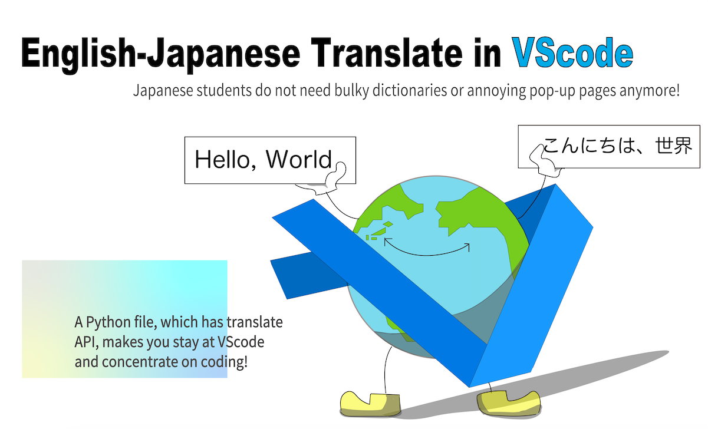

# python_translateAPI
English-Japanese translate in VScode. I submitted this as the grand challenge of [Master the Mainframe Challenge 2020](https://www.ibm.com/it-infrastructure/z/education/master-the-mainframe).

# 日英翻訳API
VScode内で完結する日英翻訳APIです。2020年度[Master the Mainframeコンテスト](https://www.ibm.com/it-infrastructure/z/education/master-the-mainframe)の最終課題として提出しました。
